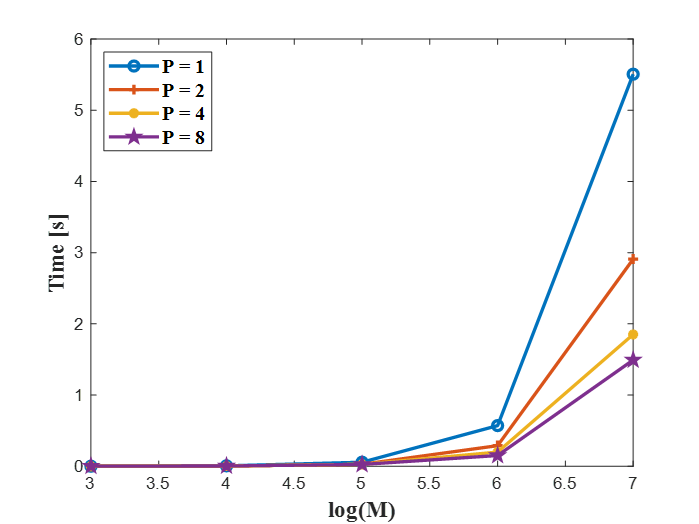

# Parallel-bucket-sort
In this repo, the parallel bucket sort is implemented using MPI. Furthermore, one function is written to find the desired median and broadcast the median value and the processor rank that has it to all processors. 

Each processor will write their initial random numbers received from processor zero and their sored bucket into two different txt files. It should be mentioned that for running the code, you also need to pass the desired median as a command line argument. 

## Description of useful functions
The MPI_Alltoall_vecvecT function is a combination of MPI_Alltoall and MPI_Alltoallv. The function receives two buffers of vector of vectors (one containing data for send and one for receiving data). The number of rows of these vectors of vectors should be equal to the number of processors, and the columns (inner vector) are the data for sending or buffer for receiving. The receive buffer size does not need to be initiated. When all processor calls this function (since it is a collective function, it is necessary to be called by all processors), each row of sending buffers of all processors will be sent to the corresponding processor rank. For example, all first rows of sending buffers will be sent to the processor zero and the same for other processors. MPI_Alltoall_vecvecT first of all, make all processors aware of how much data they will be receiving using MPI_Alltoall, and then the data will be sent to processors utilizing MPI_Alltoallv. 

## Computational complexity

The code was run with a different number of processors (P) and random numbers (M). The timings for just part of the algorithm related to the bucket sort are tabulated in the table below (generating and distributing random numbers, finding median, and saving numbers to txt files did not consider for this time calculations). Based on the table below, when M is small (i.g. 1000) by increasing the number of processors, the processing time has also been increased because the communication is much more than the computation. However, when M is relatively large enough (i.g 10^5, 10^6, and 10^7) there is a clear inverse relationship between time and P. As p grows, the parallel time has been reduced, which is good. Moreover, it seems that the computational complexity of the implemented bucket sort is O(N) because by making the number of random numbers 10 times bigger, the processing time has been multiplied by approximately 10. This fact can be vividly seen by looking at the processing time of the code with different p when increasing M from 10^6 to 10^7.
|     M    |     10^3         |     10^4        |     10^5        |     10^6       |     10^7       |
|----------|------------------|-----------------|-----------------|----------------|----------------|
|     P    |                  |                 |                 |                |                |
|     1    |     0.0006849    |     0.005713    |     0.056817    |     0.57099    |     5.50691    |
|     2    |     0.0006331    |     0.003142    |     0.028026    |     0.28975    |     2.90935    |
|     4    |     0.0007886    |     0.003219    |     0.026617    |     0.19935    |     1.85155    |
|     8    |     0.0015053    |     0.004166    |     0.024984    |     0.15118    |     1.49275    |

